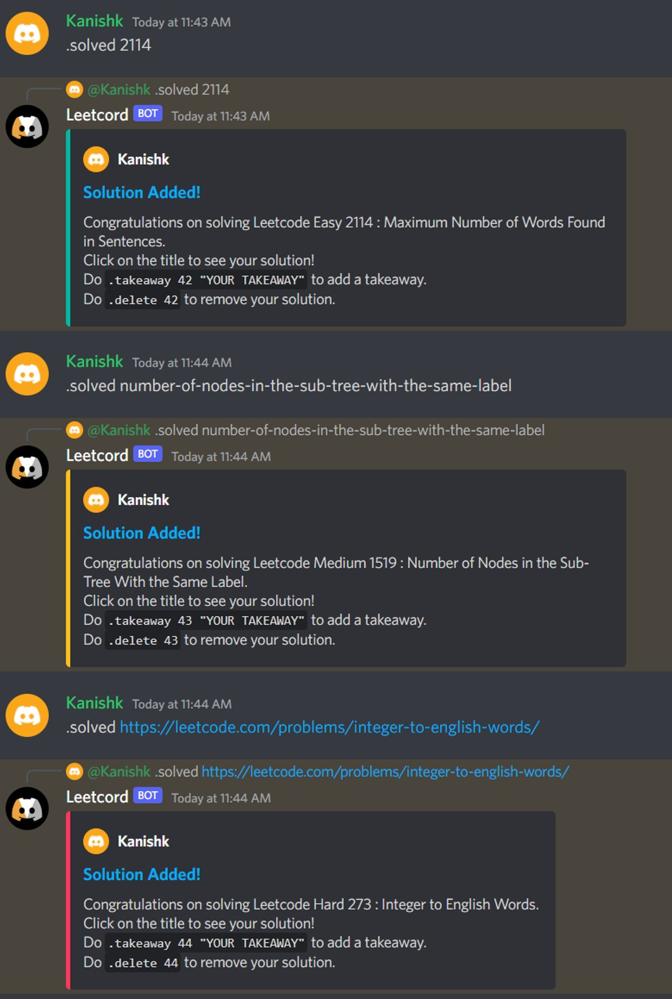
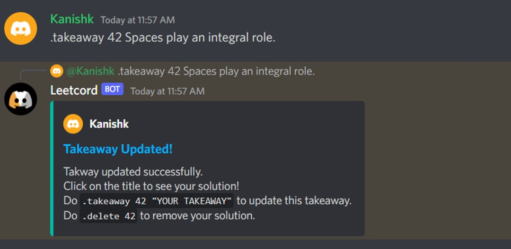
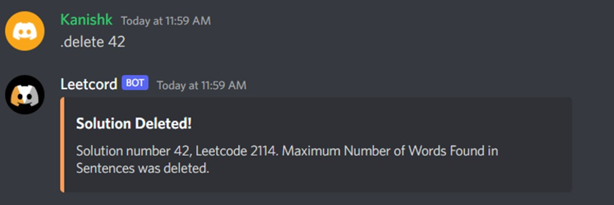
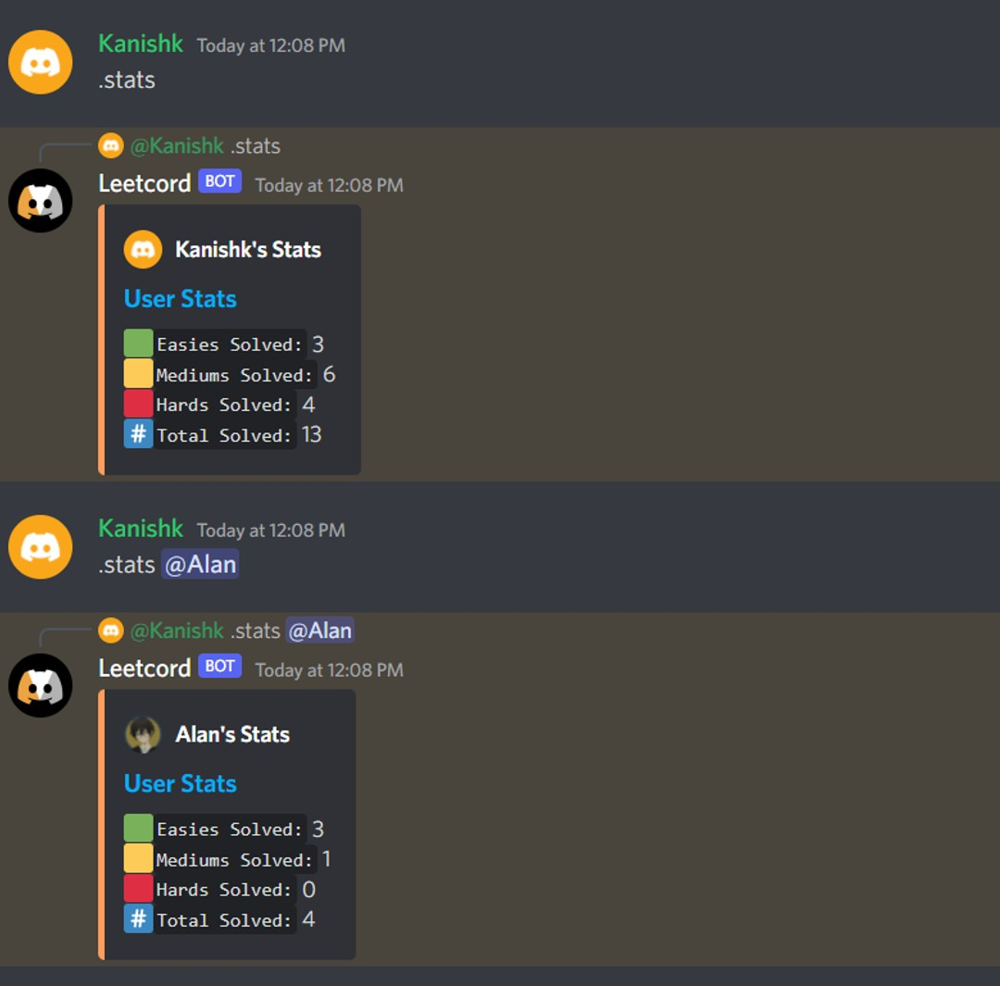
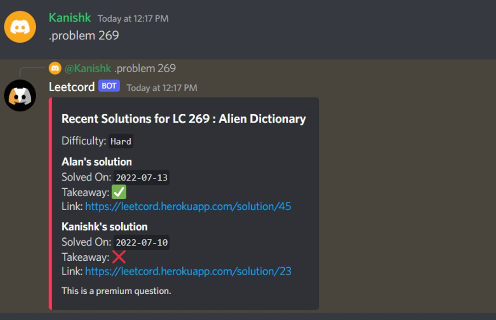
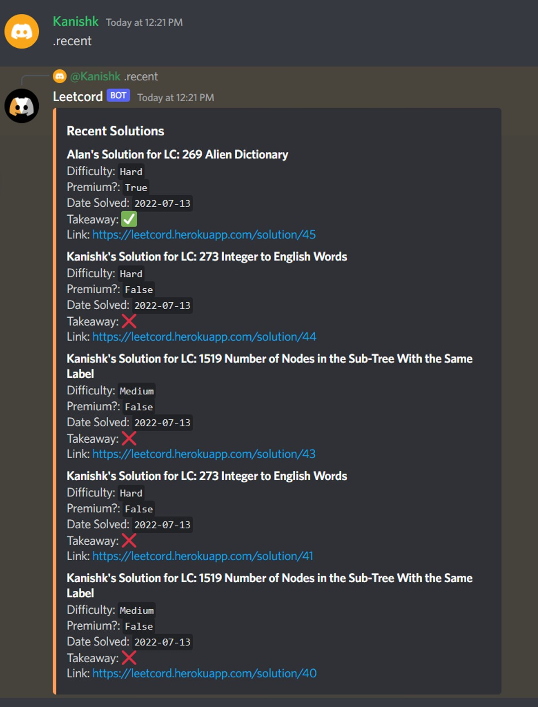
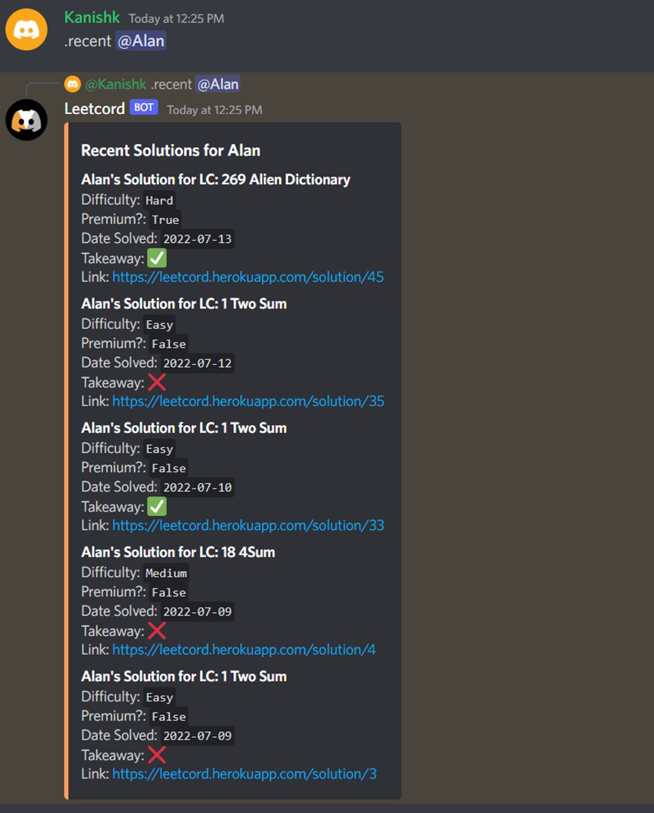
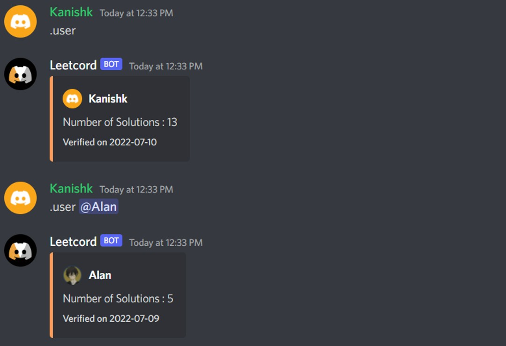
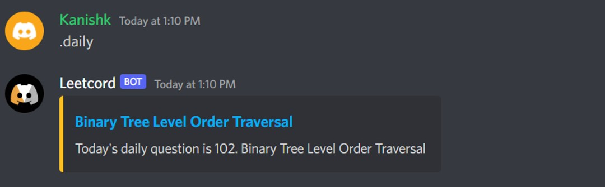
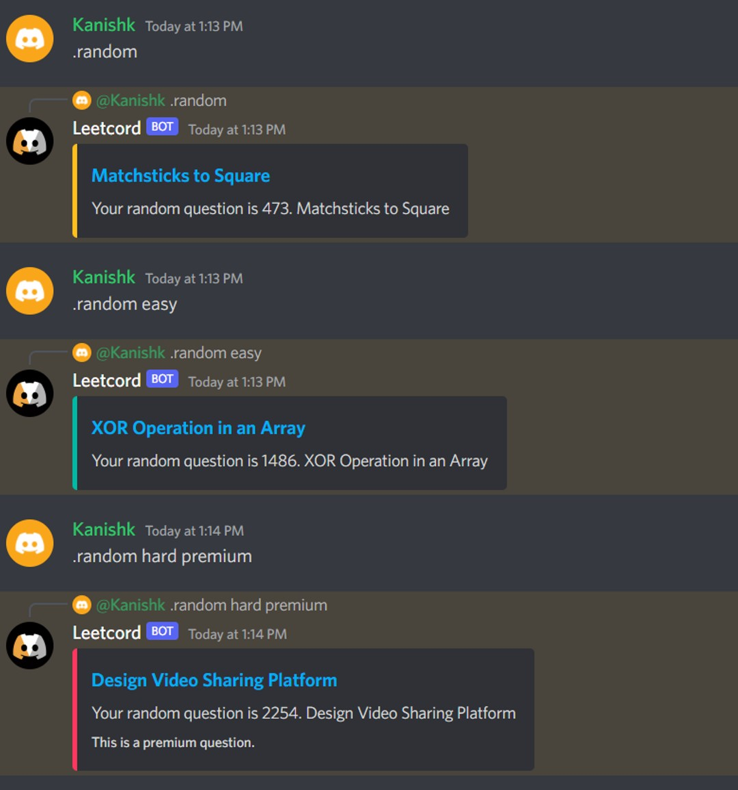

<h1>Leetcord</h1>
<p align="center">
    
<p>
Leetcord is an application that provides an integration between Discord and LeetCode to create a fun and interactive platform for users to share, compare, or store solutions with their friends. The application is designed to store short takeaways such that individuals can learn from one another.

## Table of Contents
1. [Features](#FEATURES)
2. [Requirements](#REQUIREMENTS)
3. [Setup](#SETUP)
4. [Deploy](#DEPLOY)
5. [Commands](#COMMANDS)

## Features <a id="FEATURES"></a>
- Provides a platform for friends to share and keep track of their solutions on leetcode. 
- Allocates space for users to leave remarks or takeaways after solving a problem to supplement their learning and enhance that of others.
- An excellent addition to coding-centric discord servers looking to increase or promote collaboration and a friendly competitive environment.
- Django's admin console provides an simple GUI to handle data entry, deletion, and modification while also providing an excellent interface to view collected data through the frontend.
- The discord bot allows for rapid integration to almost every discord server and can be deployed to several different servers at once.
- Can be setup and deployed quickly through heroku and Azure SQL.
- If you are a GitHub student you can effectively deploy this for free.

## Requirements <a id="REQUIREMENTS"></a>
1. Python 3.8+
> ⚠ Although we have solely tested on Python 3.8.13 higher versions should still be stable for this repository. Make sure to update `runtime.txt` accordingly.
2. Install pip requirements: `pip install -r requirements.txt`
3. Download [ODBC 17 Driver for Azure](https://www.microsoft.com/en-us/download/details.aspx?id=56567)
> ⚠ This is only necessary if you decide to use Azure SQL for your database. Using a different SQL varient may affect setup.
4. [Download Heroku CLI](https://devcenter.heroku.com/articles/heroku-cli)  
> ⚠ This is only necessary if you decide to deploy your application to Heroku. Using a different cloud provider may affect setup.
5. [Provision a Azure SQL DB](https://docs.microsoft.com/en-us/azure/azure-sql/database/single-database-create-quickstart?view=azuresql&tabs=azure-portal)
6. [Create a Heroku Application](https://trailhead.salesforce.com/en/content/learn/projects/develop-heroku-applications/create-a-heroku-app) [Follow till step 6, name the application whatever feels reasonable.]
7. [Setup a Discord Bot](https://discordpy.readthedocs.io/en/stable/discord.html)
8. Fork this repository.

## Setup <a id="SETUP"></a>
1. Create a `config.json` file at the root of the repository
```json
{
    "DISCORD_TOKEN" : "YOUR DISCORD TOKEN",
    "SECRET_KEY" : "YOUR DJANGO SECRET KEY",
    "DBNAME" : "YOUR DB NAME",
    "DBUSER" : "YOUR DB USER",
    "DBPASS" : "YOUR DB PASS",
    "DBHOST" : "YOUR DB ENDPOINT",
    "ADMIN_IDS" : "DISCORD_ADMIN_1_ID,DISCORD_ADMIN_2_ID,..."
}
```
2. Add these values as environment variables in your Heroku application.
3. Configure your Django DB Properly in `Web/LeetcodeTracker/settings.py`
> ✅ If you're running Azure SQL you do not need to change this.
```python
if os.getenv("SECRET_KEY"):
    # Running on server connect to database.
    DATABASES = {
        "default": {
            "ENGINE": "mssql",
            "NAME": os.getenv("DBNAME") or data["DBNAME"],
            "USER": os.getenv("DBUSER") or data["DBUSER"],
            "PASSWORD": os.getenv("DBPASS") or data["DBPASS"],
            "HOST": os.getenv("DBHOST") or data["DBHOST"],
            "PORT": "1433",
            "OPTIONS": {"driver": "ODBC Driver 17 for SQL Server", },
        },
    }
else:
    # If running local use an SQL Lite.
    DATABASES = {
        'default': {
            'ENGINE': 'django.db.backends.sqlite3',
            'NAME': BASE_DIR / 'db.sqlite3',
        }
    }
```
4. Test your Django Application locally.
```bash
cd Web
python manage.py makemigrations
python manage.py migrate
python manage.py runserver
```
5. Configure your SQLAlchemy DB Connection properly in `Bot/db/db_constants.py`
> ✅ If you're using Azure SQL you do not need to change this.
```python
    CONNECTION_STRING = 'Driver={ODBC Driver 17 for SQL Server}'+ \
                        ';SERVER='+load("DBHOST")+',1433' + \
                        ';DATABASE='+load("DBNAME")+ \
                        ';UID='+load("DBUSER")+ \
                        ';PWD='+load("DBPASS")

    CONNECTION_URL = URL.create(
                        "mssql+pyodbc", 
                        query={"odbc_connect": CONNECTION_STRING}
                    )

```
6. Test your Discord Bot locally
```bash
cd Bot
python main.py
```

## Deploy <a id="DEPLOY"></a>
1. Link Forked Repo to Heroku
```bash
heroku git:clone -a <APPLICATION_NAME> 
```
2. Add buildpacks to heroku application
```
heroku buildpacks:add --index 1 heroku-community/apt
heroku buildpacks:set heroku/python
heroku buildpacks:addhttps://github.com/matt-bertoncello/python-pyodbc-buildpack.git
```
> Credit: [@matt-bertoncello](https://github.com/matt-bertoncello/python-pyodbc-buildpack) for Azure Buildpack Instructions. The Aptfile is already configured.
3. Deploy to Heroku
```bash
git push heroku main
```
## Commands <a id="COMMANDS"></a>
* Solved: `.solved [Leetcode Number/Leetcode Slug/Leetcode URL]`
  > If the user is registered they can add a solution to the database. On success the command will send an embed containing a link to the solution. Otherwise, if it fails, the command will indicate as such.
  
* Add Takeaway: `.takeaway [Solve ID] (Takeaway)`
  > If the user is registered and is associated with a solution they can add a takaway to their solution. On success the command will send an embed containing a link to the solution. Otherwise, if it fails, the command will indicate as such.
  
* Delete Solution: `.delete [Solve ID]`
  > If the user is registered and is associated with a solution they can delete it.
  
* Get Stats: `.stats (Mention)`
  > Gets a member's stats. If no member is provided, the caller's stats will be displayed.
  
* Get Problem: `.problem [Leetcode Number/Leetcode Slug/Leetcode URL]`
  > If a problem is listed in the database it will fetch it and display the 5 recent solutions submitted for it.
  
* Get Recent: `.recent (Mention)`
  > Displays the most recent solutions sent to the database. If a user is provided the command will fetch the most recent solutions from that person.
  
  
* Leeterboard: `.leeterboard`
  > Display's the top 5 users with most solved problems.
  
* Get User Info: `.user (Mention)`
  > If a Member is given it will display their number of solutions as well as a link to their information. Otherwise it will display the invoker's information. If the user doesn't exist it will indicate as such.
  
* Update User Info: `.update`
  > Synchronizes your Discord Image and Discord Nickname with the database.
* Daily Question: `.daily` 
  > Provides a link to LeetCode's daily question.
  
* Random Question: `.random (easy/medium/hard) (premium)`
  > This command by default provides a random choice from non-premium questions from LeetCode. If a difficulty is provided the search will be limited to that selection. If premium is passed as a parameter the search will be expanded to include premium problems.
  
* NeetCode: `.neetcode`
  > Provides a link to Neetcode.
* LeetCode: `.leetcode`
  > Provides a link to LeetCode.
* About: `.about`
  > Provides a link to the about page.